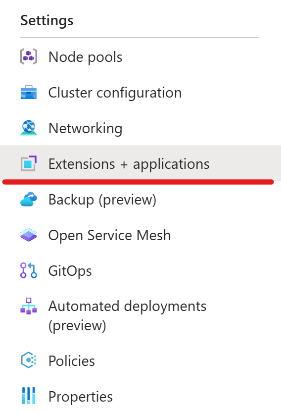
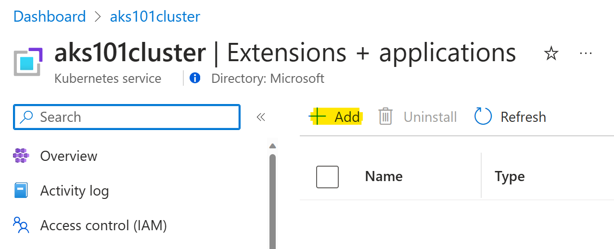
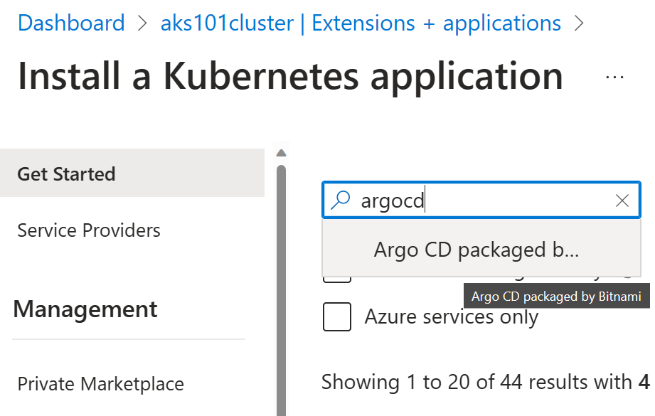
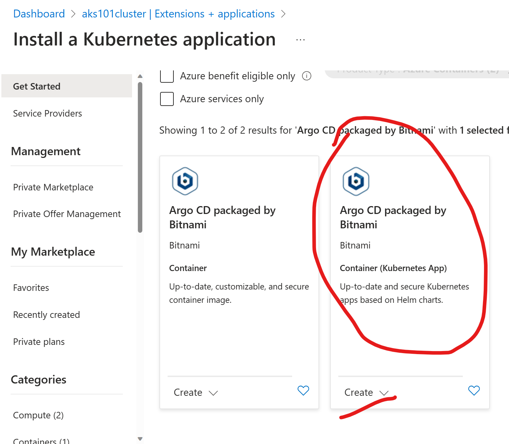
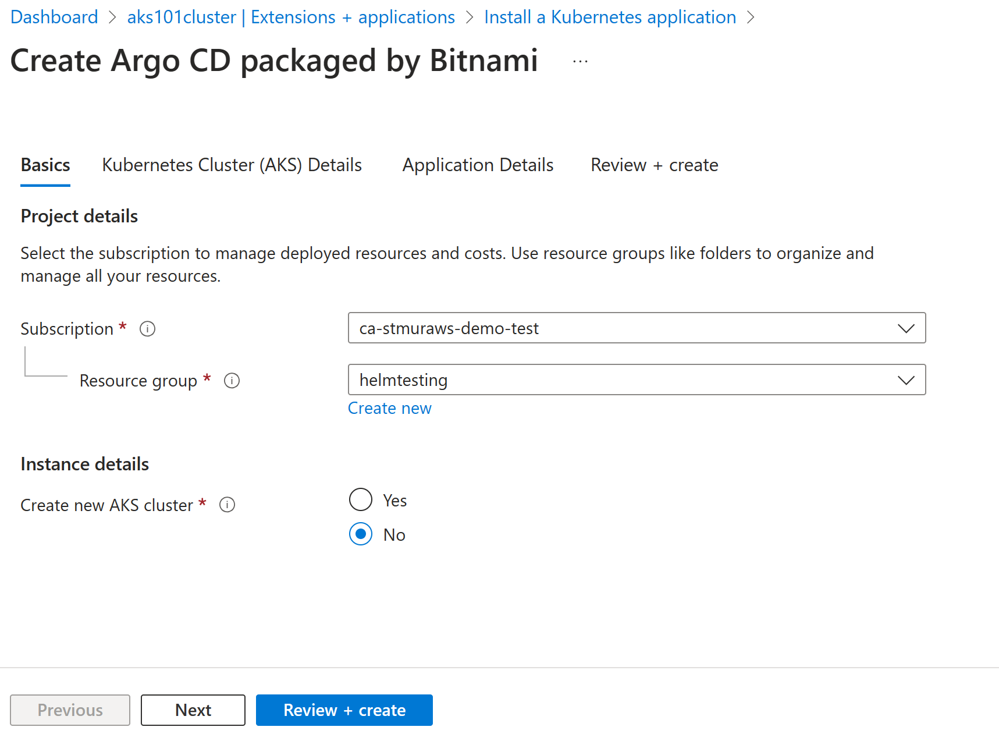
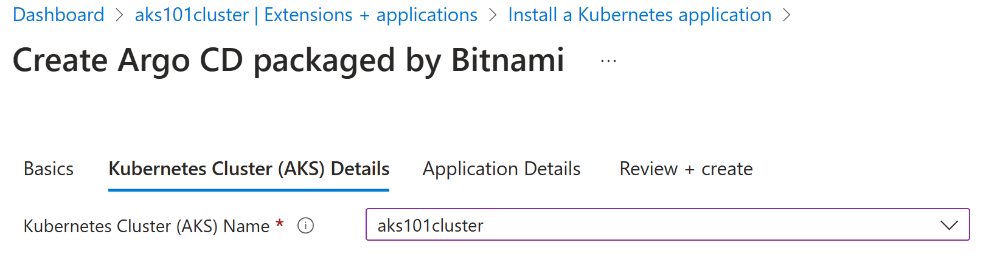
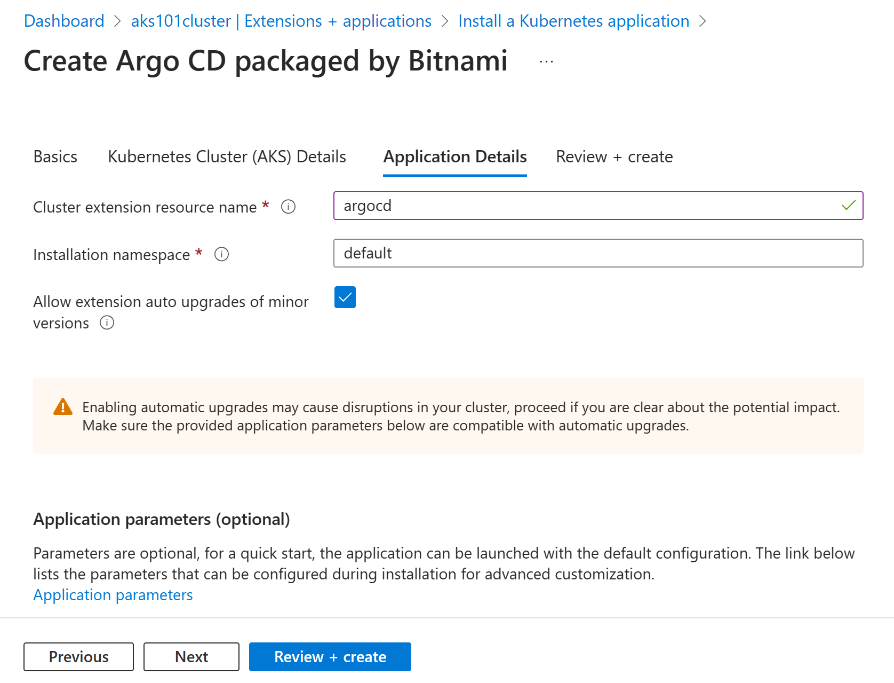
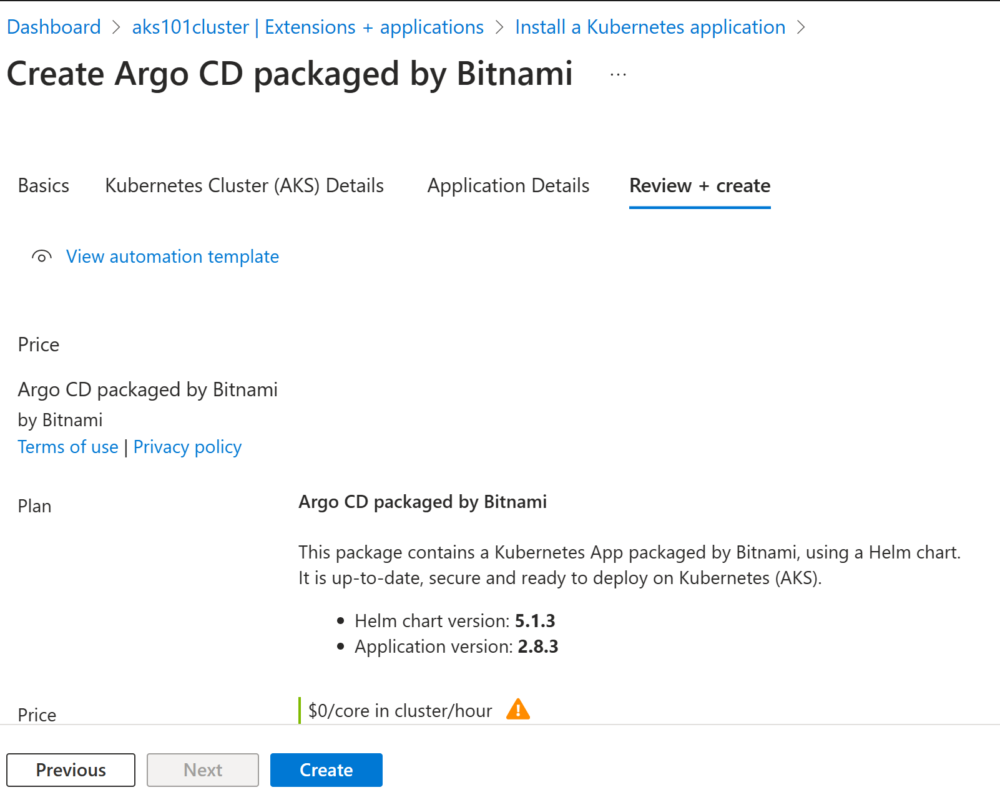
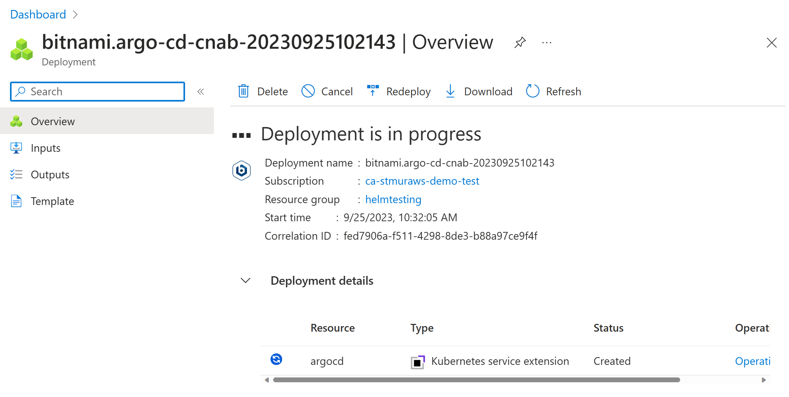
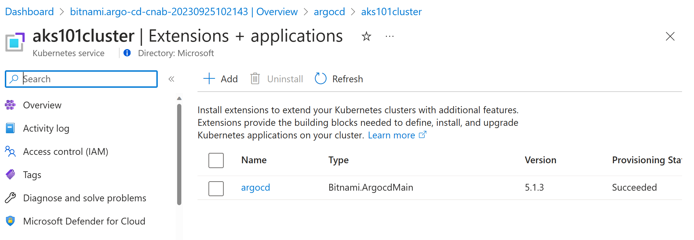

## Our GitOps Journey So Far

### What Has Come Before

Our team has dug into some of the basics of GitOps over the past week. So far, we've talked about:

- [Just Enough Git for GitOps](https://aka.ms/cloudnative/JustEnoughGit)
- [What Really Is GitOps?](https://aka.ms/cloudnative/WhatReallyIsGitOps)
- [Git going with GitOps on AKS: A Step-by-Step Guide using FluxCD AKS Extension](https://aka.ms/cloudnative/GitGoingWithGitOps)
- [What is GitOps: A Twitter Space](https://twitter.com/joshduffney/status/1704922340751032647)
- [Automating Image Updates with FluxCD on AKS](https://aka.ms/cloudnative/ImageAutomationWithFluxCD)

### A Quick Recap

#### The Principles of GitOps

**1) Declarative**

    A system managed by GitOps must have it's state expressed declaratively.

**2) Versioned and Immutable**

    Desired state is stored in a way that enforces immutability, versioning and retains a complete version history.

**3) Pulled Automatically**

    Software agents automatically pull the desired state declarations from the source.

**4) Continuously Reconciled**

    Software agents continuously observe actual system state and attempt to apply the desired state.

#### Application of the Principles

GitOps tools boil down to:

1. A Git repository

2. An artifact repository (by default, a branch in the Git repo)

3. An agent that is responsible for ensuring that the state of the cluster matches the configuration defined in the artifact repository (over time)

### Applying GitOps

Applying these principles to the use of the tools identified, we can effectively manage our Kubernetes clusters and workloads therein with auditable, automated changes and maintain a consistent configuration despite unintentional configuration drift.

## Our Next GitOps Tool Exploration - ArgoCD

Now, it's time to dig in to the next GitOps tool in the GitOps ecosystem - [Argo CD](https://argoproj.github.io/cd/).

Argo CD is part of the Argo ecosystem of tools. Argo CD is a GitOps engine and continuous delivery tool. Argo CD is a Kubernetes controller that monitors the applications running inside your cluster and ensures that it matches the desired state (as represented by manifests or Helm charts in your target repository).


## Reducing Time to Impact with the Azure Marketplace

The Azure Marketplace is integrated into our Azure Kubernetes Service (AKS) clusters and provides a way for open source and commercial offerings that are container-based to be easily deployed into AKS clusters.

## Installing ArgoCD from the Azure Marketplace

Argo CD is offered through the Azure Marketplace. Marketplace offers are installed as extensions into AKS.

We'll start in the Azure Portal on the AKS Cluster view.

### Extensions + Applications

We'll navigate down the left-hand side of the page to the _Extensions + applications_ item under _Settings_.



### Add an Application

Next, we'll select Add.



We'll put `argocd` in the search box and select the _Argo CD packaged by Bitnami_ offering. 

The search will return two options, one a container and one a Kubernetes App. We'll select the Kubernetes App and click _Create_



This will open up the _Create Argo CD packaged by Bitnami_ page. We specify a subscription and resource group, as well as whether or not we need a new AKS cluster.



The next step will be moving to the _Kubernetes Cluster (AKS) Details_ tab.



After we specified the cluster details, we move to the _Application Details_ tab. Here, we add a resource name (which has to be lowercase letters or numbers - no symbols - of between 6 and 30 characters). We can customize the namespace, but we'll take the default. And we can decide if we want the extension to be able to automatically deploy minor version updates.



The last step of this process is to go to the _Review + create_ tab. Here we'll see the versions of the application and deployment resources, as well as any potential cost (for the packaged application specifically) and other details like terms of use. We'll click _Create_ here.



Clicking _Create_ kicks of the deployment process.



After the deployment completes, we'll have _argocd_ listed in our _Extension + applications_ section of our AKS Cluster.



### Access the Argo CD Server

We'll retrieve the Argo CD Server password with `kubectl`.

```
kubectl get secret argocd-secret -o jsonpath='{.data.clearPassword}' | base64 --decode
```

(or if you are like me and using PowerShell)

```
kubectl get secret argocd-secret -o jsonpath='{.data.clearPassword}'  | % {[system.text.encoding]::utf8.getstring([system.convert]::FromBase64String($_))}
```

Then, we need to expose the Argo CD server so we can access it from our workstation.

```
kubectl port-forward svc/argocd-argo-cd-server 30443:80
```

Then, we can access the Argo CD Server at `https://localhost:30443` with the user name `admin` and the password we retrieved in the previous step.

From there, we could jump into [the sample in the Argo CD documentation](https://argo-cd.readthedocs.io/en/stable/getting_started/#6-create-an-application-from-a-git-repository) and carry on from there.

## Summary

The AKS Marketplace provides a convenient way to installed a somewhat managed experience and quickly get started with new applications.

Getting Argo CD up and running is pretty simple and we can start exploring it in greater depth in our AKS environment.

### Continue the conversation

Leave your questions in the comments or come over to the Microsoft Open Source Discord and chat with me and my team in the _cloud-native_ channel!

- [Join the Microsoft Open Source Discord](https://aka.ms/cloudnative/JoinOSSDiscord)
- [Meet us in the Cloud Native Channel](https://aka.ms/cloudnative/JoinOSSDiscord)

And check back with our team tomorrow, as [Paul](https://dev.to/pauldotyu) digs into [Flagger](https://fluxcd.io/flagger/).
